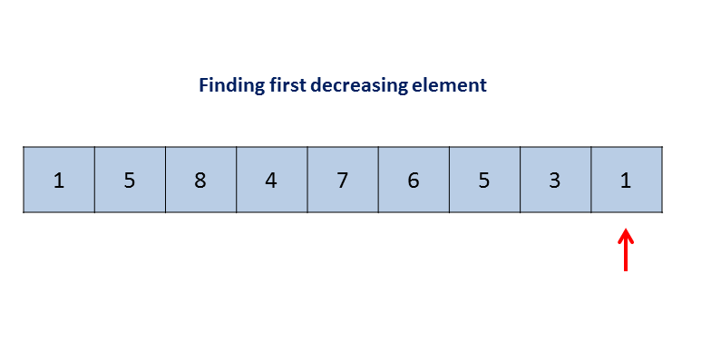

# 31. Next Permutation



1. Find the first decreasing number `nums[x]` from end to start;
2. Find the `nums[y]` from \(x, end\] which is just larger than `nums[x]`;
3. Swap `nums[x]` and `nums[y]`;
4. Sort \(x, end\]

Time Complexity: 

* Step 1 and 2 takes `O(n)`, step 3 takes `O(1)`, step 4 takes `O(nlogn)`, therefore the total time complexity is `O(n+n+1+nlogn)` = `O(nlogn)`.

Space Complexity:

* Constant space used. `O(1)`.

```go
import "sort"

func nextPermutation(nums []int)  {
    // corner cases
    if len(nums) <= 1 {
        return
    }
    
    // find first decreasing number nums[x] from end to start
    x := -1
    for i := len(nums)-2; i >= 0; i-- {
        if nums[i] < nums[i+1] {
            x = i
            break
        }
    }
    
    if x != -1 {
        // find the a number y from (x, end] which is just larger than nums[x]
        y := x+1
        for i := x+1; i < len(nums); i++ {
            if nums[i] < nums[y] && nums[i] > nums[x] {
                y = i
            }
        }

        // swap number x and y
        nums[x],nums[y] = nums[y],nums[x]
    }
    
    // sort (x, end]
    sort.Ints(nums[x+1:])
}
```

